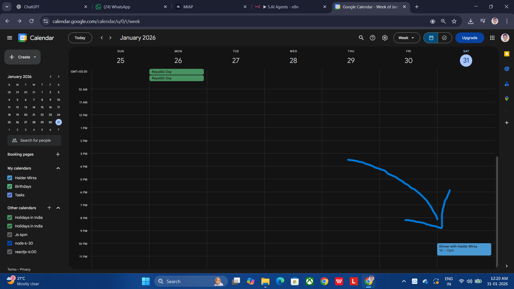
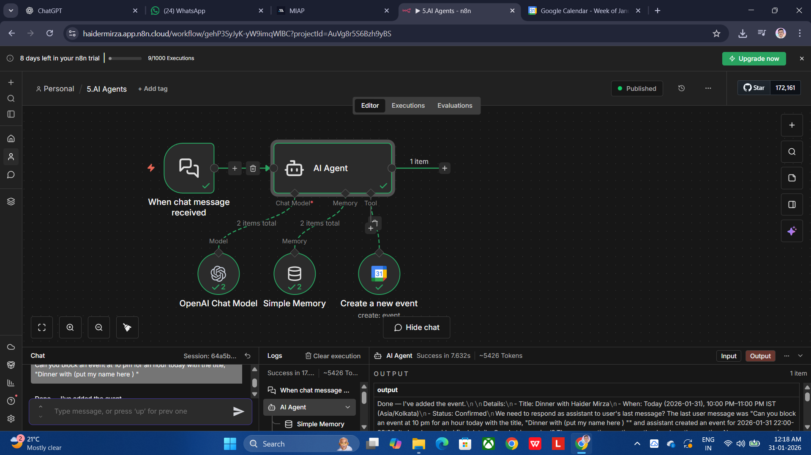

# AI Calendar Event Automation using n8n 🤖📅

## Overview
This project is an AI-powered automation built using n8n that allows users to create Google Calendar events through natural language chat messages.

The AI Agent understands user intent (date, time, title) and automatically schedules calendar events without manual input.

---

## Problem Statement

A Calendar AI Agent using n8n that:

- Uses a Chat node as the trigger
- Integrates with Google Calendar to block time slots
- Can understand natural language inputs (e.g., "block my calendar for a meeting at 2 PM tomorrow")

The agent should:

1. Receive user input via chat
2. Parse the input to extract date, time, and event details
3. Block the corresponding time slot on Google Calendar
4. Confirm the booking with the user via chat

Use n8n's Google Calendar node and Chat node to build the workflow. Test the agent with different chat inputs and calendar scenarios.

## Features
- Chat-based interaction
- AI Agent for understanding event details
- Automatic Google Calendar event creation
- Memory support for better conversation flow

---

## Tech Stack
- **n8n** (Workflow Automation)
- **OpenAI Chat Model**
- **Google Calendar API**
- **Simple Memory (n8n)**

---

## Workflow Explanation
1. User sends a chat message  
   Example:  
   > "Can you block an event at 10 PM today titled Dinner with Haider?"

2. AI Agent processes the message and extracts:
   - Event title
   - Date
   - Time

3. Google Calendar node creates the event automatically

4. Confirmation message is sent back to the user

---

## Screenshots

### Chat Interaction

### Calendar Event Created

### n8n Workflow

